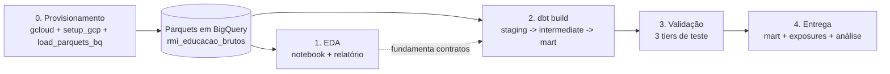
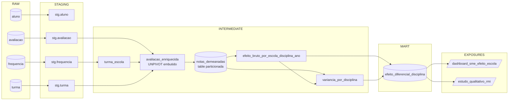

# Desafio RMI Educação - Efeito diferencial de escolas por disciplina

Pipeline de Analytics Engineering sobre dados educacionais anonimizados da rede municipal do Rio de Janeiro, em **dbt + BigQuery**.

> **Mapa de docs** - [Quickstart](#quickstart) · [Arquitetura](#arquitetura) · [Relatório completo](REPORT.md) · [Metodologia](REPORT.md#6-modelagem-analítica-três-passos) · [Decisões & arquitetura](REPORT.md#3-arquitetura-e-decisões-de-design) · [Limitações](REPORT.md#10-limitações) · [Reprodução](REPORT.md#4-reprodução-do-zero) · [Próximos passos](REPORT.md#11-trabalhos-futuros) · [EDA (notebook)](exploratory_data_analysis/01_eda.ipynb) · [Análise do mart (notebook)](results/02_mart_analysis.ipynb)

---

## Visão geral

Com um número limitado de visitas disponíveis, em quais escolas a SME deveria investigar o que está dando certo (para replicar em outras unidades) ou o que está dando errado (para intervir)? O objetivo é **gerar uma lista priorizada de escolas, separada por disciplina**. A ideia central do projeto é identificar, para cada escola, **em quais disciplinas ela consegue elevar seus alunos acima do desempenho típico daquele mesmo aluno**, ou ao contrário: **em quais disciplinas seus alunos rendem menos do que renderiam normalmente**. Nesta análise, cada aluno serve de referência para ele próprio. Compara-se suas notas nas diferentes disciplinas dentro de um mesmo ano. Como fatores como nível socioeconômico e perfil da turma afetam o aluno de maneira semelhante em todas as matérias, eles são naturalmente neutralizados.

**Método.** Para cada aluno em cada ano, comparam-se suas notas nas diferentes disciplinas com a sua própria média naquele ano, isolando assim o efeito específico da escola por disciplina. Em seguida, aplica-se um ajuste estatístico que modera estimativas baseadas em poucos alunos, evitando conclusões precipitadas para escolas pequenas.

**Entregável.** O mart `mart_educacao__efeito_diferencial_disciplina`, organizado no nível `(escola, disciplina, ano letivo)`, traz duas colunas independentes entre si. A primeira, `classificacao`, ordena o efeito da escola em cinco faixas de intensidade: `forte_positivo`, `moderado_positivo`, `indistinguivel`, `moderado_negativo` e `forte_negativo`. A segunda, `confianca_estatistica`, indica se o resultado é robusto o suficiente para se confiar nele (`significativo`) ou se ainda há incerteza demais para concluir algo (`inconclusivo`), com base em um intervalo de confiança de 95%. Cruzando os dois critérios, efeito forte e estatisticamente confiável, chega-se às escolas candidatas a um estudo qualitativo mais aprofundado.

| Camada       | Artefato                                                 |             Quantidade |
| ------------ | -------------------------------------------------------- | ---------------------: |
| Modelos      | staging · intermediate · mart                            |              4 · 5 · 1 |
| Testes       | schema (Tier 1+3) · singulares (Tier 2)                  |                 33 · 8 |
| Governança   | contracts enforced · exposures · post-hook · labels      | 6 · 2 · 1 · por-camada |
| Packages     | `dbt_utils` · `dbt_expectations`                         |                      2 |
| Freshness    | metadata (3 sources) · `data_inicio` real (`frequencia`) |                  mista |
| Macros       | `generate_schema_name` · `apply_policy_tags`             |                      2 |
| Scripts      | `setup_gcp` · `load_parquets_bq` · `reproduce`           |                      3 |
| EDA          | notebook + 9 figuras                                     |                      ✓ |
| Análise mart | notebook + 4 figuras + 3 top-10 CSV                      |                      ✓ |
| CI           | offline em PR (lint, parse, compile, secrets)            |             1 workflow |

---

## Quickstart

**Pré-requisitos:** Python 3.12, `gcloud` CLI, conta Google com projeto GCP em modo Sandbox.

```bash
git clone <repo> && cd desafio-rmi
python3.12 -m venv .venv && source .venv/bin/activate
pip install -r requirements.txt
mkdir -p ~/.dbt && cp profiles-example.yml ~/.dbt/profiles.yml
export DBT_GCP_PROJECT=<seu-projeto-sandbox>
gcloud auth application-default login
./scripts/reproduce.sh
```

O script `reproduce.sh` executa 7 etapas: `setup_gcp.sh` -> `load_parquets_bq.sh` -> `dbt deps` -> `dbt debug` -> `dbt source freshness` -> `dbt build` -> `dbt docs generate`. Para abrir o lineage no navegador: `dbt docs serve --port 8080 --target dev_bq`. 

---

## Arquitetura

### Workflow end-to-end



### Data lineage



---
