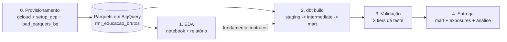
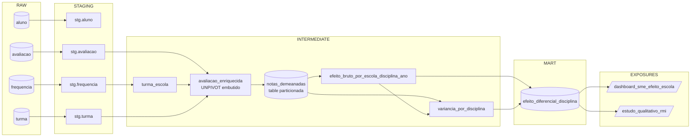

# Desafio RMI Educação - Efeito-Escola Diferencial por Disciplina

Pipeline de Analytics Engineering em **dbt** sobre dados educacionais anonimizados da rede municipal do Rio de Janeiro, materializado em **Google BigQuery**.

---

## Resumo

A pergunta proposta é: em quais disciplinas cada escola eleva ou rebaixa seus alunos em relação ao próprio padrão deles? Cada aluno serve de referência para ele próprio, o que neutraliza naturalmente fatores como nível socioeconômico e perfil da turma. O método combina dois passos: (i) centralizar as notas pela média do próprio aluno e (ii) ajustar estatisticamente para moderar estimativas baseadas em poucos alunos. A entrega é um pipeline com 4 modelos de limpeza, 5 modelos intermediários e 1 tabela final pronta para consumo, com 41 testes automatizados, documentação técnica e dois consumidores ilustrativos declarados (um painel para gestão e uma aplicação para pesquisa qualitativa). O resultado é uma lista priorizada de escolas por disciplina e ano, com magnitude do efeito e com robustez estatística; pensadas para triagem de escolas candidatas a estudo qualitativo.

---

## Sumário

- [§1. Contexto e objetivo](#1-contexto-e-objetivo)
- [§2. Visão geral da solução](#2-visão-geral-da-solução)
- [§3. Arquitetura e decisões de design](#3-arquitetura-e-decisões-de-design)
- [§4. Reprodução do zero](#4-reprodução-do-zero)
- [§5. Análise exploratória](#5-análise-exploratória)
- [§6. Modelagem analítica em três passos](#6-modelagem-analítica-em-três-passos)
- [§7. Estratégia de testes](#7-estratégia-de-testes)
- [§8. Resultados](#8-resultados)
- [§9. Discussão - leitura de negócio](#9-discussão--leitura-de-negócio)
- [§10. Limitações](#10-limitações)
- [§11. Trabalhos futuros](#11-trabalhos-futuros)
- [§12. Mapa de cobertura do desafio](#12-mapa-de-cobertura-do-desafio)
- [Apêndice - Referências](#apêndice--referências)

---

## §1. Contexto e objetivo

O Registro Municipal Integrado (RMI) consolida dados de saúde, educação, assistência social e dezenas de outros sistemas da Prefeitura do Rio de Janeiro. O desafio entrega arquivos no formato **Parquet** (colunar, eficiente para leitura analítica) com dados educacionais anonimizados, e pede um projeto dbt que os transforme em camadas analíticas, com estratégia de testes de qualidade, documentação e uma análise final orientada a um gestor público.

### Pergunta escolhida

O enunciado sugere dois exemplos de tabela final: absenteísmo crônico por região, ou desempenho por perfil de turma. Optei por uma terceira pergunta - **efeito-escola diferencial por disciplina** - alinhada com a diretriz "profundidade importa mais que completude" do enunciado:

- *Em quais disciplinas cada escola consegue elevar seus alunos acima do que renderiam normalmente, e em quais disciplinas eles rendem abaixo?*

Cada aluno serve de referência para si mesmo. Comparam-se suas notas em diferentes disciplinas dentro de um mesmo ano. Como nível socioeconômico e perfil da turma afetam o aluno de maneira parecida em todas as matérias, esses fatores são naturalmente neutralizados - o que sobra é o desvio disciplinar, atribuível à escola para aquela disciplina.

### Por que esta pergunta

Antes de ser uma escolha analítica, foi de certa forma, uma escolha imposta pelos dados. A análise exploratória (§5) mostrou dois bloqueios para perguntas com recorte geográfico, (i) o Parquet `escola.parquet` traz apenas `escola_id` e um hash de bairro, sem atributos descritivos como nome, CEP ou coordenadas; e (ii) os hashes de bairro em `aluno`/`escola` não cruzam com `datario.dados_mestres.bairro` (overlap zero, achado 5). Recortes por região, vulnerabilidade do entorno ou perfil do bairro portanto não são viáveis. A pergunta de efeito-escola diferencial usa apenas notas (`avaliacao`), matrícula (`turma`) e a relação `turma -> escola` recuperada de `frequencia`.

| Critério                | Como esta pergunta atende                                                                                                                                                   |
| ----------------------- | --------------------------------------------------------------------------------------------------------------------------------------------------------------------------- |
| Profundidade analítica  | Trata um problema de inferência observacional, não apenas uma agregação.                                                                                                    |
| Validade dos testes     | Permite testes algébricos da metodologia (soma do demeaning, monotonicidade do shrinkage, conservação de linhas) que validam corretude do pipeline.                         |
| Aderência aos dados     | Funciona com dados aleatorizados - usa cada aluno como controle de si próprio, o que reduz a dependência de propriedades agregadas que a anonimização possa ter perturbado. |
| Utilidade para o gestor | Produz duas dimensões (magnitude x confiança) que orientam escolha de escolas para visita técnica.                                                                          |

### Entregável

A tabela final `efeito_diferencial_disciplina` (no dataset `rmi_educacao_marts`) tem grão (escola, disciplina, ano letivo) e duas colunas principais (independentes entre si) para leitura:

- `classificacao` - magnitude do efeito em cinco faixas (`forte_positivo`, `moderado_positivo`, `indistinguivel`, `moderado_negativo`, `forte_negativo`).
- `confianca_estatistica` - `significativo` se o intervalo de confiança 95% (faixa onde o valor verdadeiro tem 95% de chance de cair) inteiro está acima ou inteiro abaixo de zero; `inconclusivo` se cruza zero.

Cruzando as duas, escolas com efeito forte e estatisticamente robusto entram na fila de candidatas a um estudo qualitativo aprofundado.

---

## §2. Visão geral da solução

*Fluxo end-to-end: provisionamento da infraestrutura no Google Cloud, ingestão dos Parquets em BigQuery, transformações em três camadas dbt e validação por uma malha de testes.*



**Stack:** dbt-core 1.11 + dbt-bigquery; BigQuery Sandbox (modo gratuito, sem cobrança, com limite de 1 TB de processamento por mês); Python 3.12 com `polars`, `pandas`, `pyarrow`, `matplotlib` e `seaborn` para a análise exploratória; pacotes `dbt_utils` e `dbt_expectations` para testes de qualidade.

**Fluxo resumido:** Os Parquets são copiados do bucket público do desafio para um dataset bruto em BigQuery via `bq load --replace`. O `dbt build` lê do dataset bruto, materializa as três camadas em datasets separados (`rmi_educacao_staging`, `_intermediate`, `_marts`) e roda todos os testes na ordem do grafo de dependências. Um pipeline auxiliar gera as figuras e tabelas top-N usadas em §8.

---

## §3. Arquitetura e decisões de design

### 3.1. Stack e camadas

O pipeline segue a convenção dbt de três camadas: **staging** (limpeza 1:1 da fonte), **intermediate** (preparação analítica, sem ainda ser entregável de negócio) e **marts** (tabela final pronta para consumo).

| Camada | Modelos | Materialização | Schema (dataset BQ) |
|---|---|---|---|
| Staging | 4 | `view` (consulta nomeada, sem dados próprios) | `rmi_educacao_staging` |
| Intermediate | 5 | `view`, exceto um modelo pivot crítico em `table` (ver 3.3) | `rmi_educacao_intermediate` |
| Mart | 1 | `table` (resultado materializado em disco) | `rmi_educacao_marts` |

Quatro fontes consumidas das cinco disponíveis no bucket. O quinto Parquet (`escola.parquet`) traz apenas `escola_id` e um hash de bairro não-joinável. O atributo `escola_id` é recuperado via `frequencia` (única tabela que carrega `turma_id` e `escola_id` juntos), eliminando a necessidade da fonte `escola`. Decisão guiada por: se a coluna não existe em prod ou não é usada, não há staging.

#### Convenção de nomenclatura

- Modelos: `{prefixo}_{domínio}__{tabela}.sql`, ex.: `stg_educacao__aluno`, `int_educacao__notas_demeanadas`, `mart_educacao__efeito_diferencial_disciplina`.
- **Aliases em BigQuery**: cada modelo declara `alias` no schema YAML para materializar sem o prefixo redundante - o modelo `mart_educacao__efeito_diferencial_disciplina` vira a tabela `efeito_diferencial_disciplina` no dataset `rmi_educacao_marts` (dataset já carrega camada e domínio). O nome dbt (com prefixo) continua sendo a chave usada em `ref()`, `--select` e nos testes.
- Colunas: chaves canônicas como `aluno_id`, `turma_id`, `escola_id`; atributos prefixados pela entidade (`aluno_bairro`, `frequencia_data_inicio`).
- YAMLs de schema seguem `_{contexto}__{tipo}.yml` (`_educacao__sources.yml`, `_educacao_stg_schema.yml`).

#### Castings não-triviais em staging

A coluna `id_aluno` chega como `BYTES` (hash com sal - tipo binário não imprimível). Convertê-la com `SAFE_CAST AS STRING` retorna NULL porque o hash não é UTF-8 válido. Aplica-se `TO_HEX(id_aluno)` - função que produz uma `STRING` segura para joins e leitura. As datas em `frequencia` chegam como STRING e são convertidas com `SAFE.PARSE_DATE` (variante de parsing que retorna NULL em vez de falhar quando o valor é inválido). Bimestres em `avaliacao` chegam como STRING `"1".."4"` e são coagidos para `INT64` via `SAFE_CAST`.

#### Deduplicação

Duas tabelas chegam com duplicatas: `avaliacao` tem 581 colisões em `(aluno_id, bimestre)` (0,26%); `frequencia` tem 2.556  duplicatas no grão `(aluno_id, turma_id, disciplina, data_inicio)` , equivalente a ~0,09% das linhas. Existem duplicatas com diferentes taxas de frequência. A staging aplica `QUALIFY ROW_NUMBER() OVER (PARTITION BY <PK> ORDER BY <desempate>) = 1` ordenando primeiro por critério de negócio (postura defensiva: menor frequência em `frequencia`, menor `turma_id` em `avaliacao`) e em seguida por todas as colunas restantes da tabela como tiebreakers finais. Isso garante determinismo mesmo se duas linhas duplicadas tiverem valores idênticos no critério principal de negócio. Em `frequencia`, o desempate primário seleciona a menor taxa (postura defensiva), mas `frequencia_percentual` não é consumida por nenhum modelo intermediate ou mart.

### 3.2. Data lineage



#### Tipos de junção (joins) e tratamento de órfãos

A análise exploratória mostrou 12,41% de linhas em `frequencia` com `turma_id` que não existe em `turma`, e 0,08% em `avaliacao`. Por isso, junções de `frequencia -> turma` e `avaliacao -> turma` são `LEFT JOIN` (preservam as linhas órfãs com `escola_id` NULL e flag de auditoria). As junções para `aluno` são `INNER JOIN` (zero órfãos observados). Filtros que poderiam excluir órfãos ficam sempre na cláusula `ON`, nunca no `WHERE` - caso contrário, um `LEFT JOIN` vira `INNER JOIN` acidentalmente.

### 3.3. Materializações, particionamento e clusters

#### Por que tabela final é `table` e intermediate é `view`

O **mart** vira `table` (tabela materializada em disco) porque é o ponto de consumo. Dashboards e aplicações precisam de respostas rápidas e previsíveis, o que só uma tabela física entrega. **Staging** e **intermediate** ficam como `view`, de forma que cada modelo é apenas uma consulta SQL nomeada, sem dados próprios. Isso garante sincronização automática com a fonte (qualquer mudança upstream propaga em segundos, sem rebuild) e custo zero de armazenamento. A alternativa para o mart em produção seria `incremental` (reescreve só o que mudou em vez da tabela inteira), mas o Sandbox bloqueia os comandos `INSERT`, `MERGE` e `DELETE` que essa estratégia exige, e portanto fica de fora neste projeto. O roteiro para possível promoção do mart a `incremental` em prod está descrito em §11.

#### Exceção: `notas_demeanadas` como `table`

Esse modelo intermediário (em dbt: `int_educacao__notas_demeanadas`, em BigQuery: `notas_demeanadas`) é a única `table` fora da camada mart. Ele aplica uma janela `AVG(nota) OVER (PARTITION BY aluno_id, ano_letivo)` que é consumida por dois modelos downstream. Como `view`, a janela seria recomputada duas vezes por execução. Como `table`, é computada uma vez e reaproveitada. Custos de armazenamento são desprezíveis para essa volumetria.

#### Particionamento e cluster do mart

```jinja
{{
    config(
        materialized='table',
        partition_by={
            'field': 'ano_letivo',
            'data_type': 'int64',
            'range': {'start': 2000, 'end': 2100, 'interval': 1}
        },
        cluster_by=['disciplina', 'classificacao', 'escola_id'],
        contract={'enforced': true}
    )
}}
```

- **Partição** (divisão física da tabela por uma coluna, de forma que consultas que filtram a coluna leem só as partições necessárias) por `ano_letivo` com passo 1 - uma partição por ano. Em prod, queries típicas (`WHERE ano_letivo = 2024`) leem uma só partição. Em dev (ano único), gera uma partição funcional. A cardinalidade de até 100 anos cabe confortavelmente no limite de 4.000 partições por tabela do BigQuery.
- **Cluster** (ordenação física por colunas escolhidas, que acelera filtros frequentes) com três níveis em ordem de cardinalidade crescente: `disciplina` (4 valores) -> `classificacao` (5) -> `escola_id` (449 no sample). Cobre os dois padrões de consulta declarados nos exposures: filtro por (disciplina x classificação) no painel da SME e lookup pontual por escola na aplicação de pesquisa.

A mesma partição é aplicada em `notas_demeanadas` (que também é `table`). 

#### Decisão: `var_between` sem floor no intermediate, mas com floor no mart

A variância entre escolas é estimada pelo método dos momentos a partir da variância dos efeitos brutos das escolas, descontando o ruído de dentro das escolas dividido pelo n efetivo (fórmula exata no apêndice abaixo). Em conjuntos degenerados (poucas escolas, padrões de NULL desbalanceados), o estimador pode retornar valor negativo. O modelo intermediate de variâncias **preserva o valor cru** (negativo se for o caso), pois aplicar floor `GREATEST(0, ...)` poderia mascarar o diagnóstico real do estimador. O mart aplica o floor numa coluna com nome distinto (`var_between_clamped`), preservando os contratos `not_null` em `peso_shrinkage` e `erro_padrao` downstream. Dessa forma, quem precisa do sinal cru lê do intermediate, e quem precisa do shrinkage lê do mart. O nome diferente impede confusão.

### 3.4. Contracts, labels, policy tags planejadas

#### Contratos de dados

Um **contrato** é uma promessa explícita sobre o schema de um modelo. Declara, no YAML, o nome e o tipo de cada coluna e quais são `NOT NULL`. Quando `contract: enforced: true` está ativo, o dbt traduz isso para um `CREATE TABLE` com tipos e restrições explícitas. Se o SQL do modelo divergir do contrato (renomear coluna, mudar tipo, virar `NULL` o que era `NOT NULL`), o build falha **no momento da materialização**, antes que qualquer modelo downstream rode contra os dados inconsistentes. Cinco intermediates e o mart estão sob contrato. Como o próprio DDL já garante `NOT NULL`, o mart se apoia nas `constraints` no contrato em vez de repetir testes `not_null` separados . Garantem a mesma cobertura, com menos queries no build.

#### Labels

**Labels** são pares chave/valor que o BigQuery anexa a cada tabela ou view como metadados pesquisáveis. Não afetam o comportamento, mas aparecem no console, nos relatórios de billing e nos resultados de `bq ls --filter`. O `dbt_project.yml` declara um conjunto por camada e o adapter dbt-bigquery as aplica automaticamente em cada materialização: `dominio: educacao`, `camada: staging|intermediate|mart`, `env: dev`, `owner: rmi_educacao` e, no mart, `lgpd: dados_anonimizados`. Em produção, podem servir para:

- **Corte de custos**: o relatório de billing do GCP agrupa consumo por label. Filtrando por `camada=mart` é possível ver quanto os dashboards consomem. `dominio=educacao` isola esse projeto de outros domínios que dividam o mesmo billing account.
- **Auditoria**: buscar por `lgpd:dados_anonimizados` lista todas as tabelas com dado pessoal sob jurisdição da lei sem precisar abrir cada schema. `owner` aponta o time responsável quando algo precisa ser revisado. `env=dev` evita que pipelines de prod consumam acidentalmente artefatos de desenvolvimento.

#### Policy tags planejadas

**Policy tags** são marcações que controlam quem pode ou não ler determinadas colunas sensíveis (mecanismo de controle de acesso por coluna alinhado a LGPD). Cada coluna sensível **a nível de aluno** (em staging e intermediate) tem `meta.policy_tags_planned` no schema declarando a categoria de policy tag (`identificador_direto`, `demografico`, `dados_de_menores_desempenho`). Uma macro `apply_policy_tags()` registrada como **post-hook** (comando SQL executado após cada materialização) emitiria os `ALTER TABLE` correspondentes. Atualmente está desabilitada (`var('apply_policy_tags', false)`), porque o Sandbox não habilita Data Catalog API. Para ligar em prod bastaria apenas substituir três placeholders pelos IDs reais da taxonomia e virar a flag para `true`. Um teste (§7.2) garante que, ao ligar a flag, placeholders não passam sem ser notados.

O **mart** não declara `meta.policy_tags_planned` em nenhuma coluna pois contém apenas dados agregados no grão (escola, disciplina, ano), sem nenhuma coluna que identifique aluno individualmente ou qualquer outra informação pessoal.

### 3.5. Freshness das fontes

**Freshness** é o mecanismo que avisa quando uma fonte deixou de ser atualizada além de um limite. Foi implementada uma estratégia mista, configurada em `_educacao__sources.yml`:

- Três fontes (`aluno`, `turma`, `avaliacao`) usam o **timestamp dos metadados do BigQuery** (`__TABLES__.last_modified_time`). Este atributo é atualizado automaticamente a cada `bq load --replace` no setup.
- A fonte `frequencia` usa **`data_inicio` como atributo `loaded_at_field`**, parseada via `SAFE.PARSE_DATE` envolvida em `TIMESTAMP`. Essa é a única fonte com coluna temporal materializada e portanto é utilizada como sinal de freshness.

Atualmente os limites em dev são frouxos (`warn_after: 10.950` dias ~ 30 anos / `error_after: 18.250` dias ~ 50 anos) para acomodar o ano `2000` da amostra anonimizada. Em prod, com ingestão diária, poderia virar, por exemplo `warn_after: 7d / error_after: 30d`. A saída esperada de `dbt source freshness --target dev_bq` é `PASS` nas três fontes e `WARN` em `frequencia`.
### 3.6. Exposures

**Exposures** declaram quem consome o mart downstream, como dashboards, aplicações, ou relatórios. Em prod,  elas tornam o lineage navegável até o ponto de consumo e permitem alertas de impacto. Se uma coluna sumir do mart, o dbt sinaliza quais exposures quebram. Dois exposures ilustrativos foram declarados no projeto:

- `dashboard_sme_efeito_escola` - um painel da Secretaria Municipal de Educação para inspeção do ranking de cada disciplina, contendo filtros por `classificacao` e `confianca_estatistica`.
- `estudo_qualitativo_rmi` - uma aplicação interna que materializa periodicamente uma lista curta de escolas para visita técnica (filtro `forte_positivo` ou `forte_negativo` x `significativo`).

Owners e URLs estão utilizando o domínio `example.com` como placeholders documentando a postura que deveria ser assumida em ambiente de produção.

### 3.7. CI/CD e segurança

Três camadas de verificação automatizada protegem o repositório, todas zero-cost por default: hooks que rodam antes do commit, workflows que rodam em cada PR, e um workflow manual que conecta ao BQ sob demanda.

#### Hooks de pre-commit (verificação local, antes do commit)

`.pre-commit-config.yaml` declara hooks que rodam em cada `git commit`: **sqlfluff** (lint SQL), **yamllint**, **detect-secrets** (varre por chaves e tokens vazados) e **check-added-large-files**. Se algum hook falha, o commit é abortado e o problema sobe na hora, não em revisão de PR. Para verificar a qualquer momento, basta executar `pre-commit run --all-files`, que roda contra o repositório inteiro, `pre-commit run` roda apenas contra arquivos staged.

#### GitHub Actions (verificação remota)

Um workflow em `.github/workflows/`:

- **`ci.yml`** - é disparado em cada PR e push para `main`. Roda offline os comandos `dbt deps`, `dbt parse`, `dbt compile`, `sqlfluff lint`, `yamllint`, e `detect-secrets`. Nunca conecta ao BigQuery, e portanto tem custo zero. Os comandos `dbt parse` e `dbt compile` capturam quebras de referências, `source().coluna` inexistentes, sintaxe Jinja, contratos e configs. Em outras palavras, caso ocorra mudança de schema na fonte, ele é capturado em compile-time, antes que qualquer query rode em BQ. Para pushes diretos em `main`, ver a aba **Actions** do repositório.

O `dbt build` contra o BigQuery roda apenas localmente, via `dbt build --target dev_bq`. Nao ha workflow remoto que execute queries no Sandbox.

#### Camadas de defesa contra custos acidentais

1. Sandbox sem billing vinculado = restrição estrutural. O comando `gcloud beta billing projects link` é proibido por convenção do projeto e é validado pelo passo `V0` do `setup_gcp.sh`.
2. `maximum_bytes_billed: 10 GB` no `profiles.yml` (target local `dev_bq`).
3. CI remoto nunca conecta ao BigQuery (apenas validacoes offline).

#### Autenticação local

A autenticação local é feita via **OAuth ADC** (Application Default Credentials), com login no navegador, e portanto sem chave em disco. O `.gitignore` ignora `*-sa*.json`, `*keyfile*.json`, `.env`, `profiles.yml`, `data/*.parquet` - nunca o curinga `*.json` genérico, que poderia mascarar arquivos legítimos.

---

## §4. Reprodução do zero

**Pré-requisitos.** Conta Google com um projeto GCP em modo Sandbox (sem billing); Python 3.12; Google Cloud SDK (`gcloud`, `bq`, `gsutil`); acesso ao bucket `gs://case_vagas/rmi/`.

**Setup (execute apenas uma vez por máquina):**

```bash
git clone <repo> && cd desafio-rmi
python3.12 -m venv .venv && source .venv/bin/activate
pip install -r requirements.txt
pip install -r requirements-dev.txt # opcional (para notebooks + linters)

cp profiles-example.yml ~/.dbt/profiles.yml
export DBT_GCP_PROJECT=<seu-projeto-sandbox> # ou edite .env (cp .env.example .env)
gcloud auth application-default login
```

**E para executar o projeto end-to-end:**

```bash
./scripts/reproduce.sh
```

O script encadeia sete etapas:

1. `setup_gcp.sh` - valida que billing está desligado (V0), que `datario.dados_mestres.bairro` está em `US` (V1) e que o bucket dos Parquets está acessível (V2); além disso, cria os 4 datasets necessários.
2. `load_parquets_bq.sh` - `bq load --replace` dos 4 Parquets em `rmi_educacao_brutos`.
3. `dbt deps` - instala `dbt_utils` e `dbt_expectations`.
4. `dbt debug --target dev_bq` - checa conexão antes de gastar cota.
5. `dbt source freshness --target dev_bq` - exercita o gate; warn esperado em `frequencia`.
6. `dbt build --target dev_bq` - roda o grafo inteiro (modelos + testes na ordem de dependência).
7. `dbt docs generate --target dev_bq` - produz catálogo + manifest para o lineage.

**Para executar o lineage interativo.**

```bash
dbt docs serve --port 8080 --target dev_bq
```

**Alguns exemplos de comandos seletivos opcionais**

```bash
dbt build --select mart_educacao__efeito_diferencial_disciplina --target dev_bq
dbt build --select state:modified+ --target dev_bq
dbt test --select tag:staging --target dev_bq
dbt test --select test_type:singular --target dev_bq
```

---

## §5. Análise exploratória

*Notebook de origem: `exploratory_data_analysis/01_eda.ipynb`. Computações 100% locais em Python, com zero consumo de cota BQ. Cinco achados  principais pautaram as decisões de modelagem.*

### Volumetria

| Tabela       |    Linhas | Storage |
| ------------ | --------: | ------: |
| `aluno`      |    97.044 |      3% |
| `turma`      |    97.044 |      3% |
| `frequencia` | 2.727.684 | **88%** |
| `avaliacao`  |   221.687 |      5% |

Total ~73 MB nos Parquets, ~110 MB em BigQuery (confortavelmente abaixo do teto de 10 GB). `frequencia` domina o volume.

### Achado 1 - Schema real diverge da nomenclatura canônica

Colunas reais nos Parquets são `id_aluno`, `id_turma`, `id_escola` (não `aluno_id`, `turma_id`, `escola_id` conforme foi sinalizado). Além disso, `id_aluno` é tipo `BYTES` (hash binário). A staging renomeia 1:1 e converte com `TO_HEX` para `STRING` segura.

### Achado 2 - `turma` é relação, não dimensão

A tabela `turma` traz só três colunas: `aluno_id`, `turma_id`, `ano`. Não há `escola_id`, `serie` ou `turno`. A relação `turma -> escola` é obtida com `SELECT DISTINCT (turma_id, escola_id) FROM frequencia`, que é a única fonte que carrega ambas as colunas juntas. Isso cria a primeira camada intermediate (`turma_escola`).

### Achado 3 - `avaliacao` em formato wide e Inglês 100% NULL

A tabela `avaliacao` tem quatro colunas `disciplina_1..4` (em formato wide, ou seja, uma coluna por disciplina). O modelo intermediate `avaliacao_enriquecida` aplica um `UNPIVOT` para transformar em formato long (uma linha por par aluno-disciplina) e mapeia os códigos para nomes (`disciplina_1 -> Português`, `disciplina_2 -> Ciências`, `disciplina_3 -> Inglês`, `disciplina_4 -> Matemática`). Inglês é 100% NULL na amostra. O filtro `WHERE nota IS NOT NULL` na CTE remove as linhas vazias.

NULLs nas demais disciplinas seguem padrão monotônico decrescente por bimestre: 24% no B1, 4% no B4. NULL é preservado em staging (carrega informação de ausência) e tratado em intermediate sob regra de negócio explícita.

### Achado 4 - Órfãos: 12,41% em `frequencia -> turma`

338.536 de 2.727.684 linhas em `frequencia` referenciam uma `turma_id` inexistente em `turma` (12,41%); 184 linhas em `avaliacao` (0,08%) idem. As junções intermediate são `LEFT JOIN` com flag `turma_desconhecida` para auditoria, e os testes de relacionamento usam **severity condicional**: `warn` em dev, `error` em prod (§7.3).

### Achado 5 - `bairro` é hash não-joinável com `datario`

`aluno.bairro` e `escola.bairro` são INT64 hash com sal; `id_bairro` em `datario.dados_mestres.bairro` é INT64 entre 1 e 166. O overlap em CAST é zero linhas (verificado empiricamente; o SQL está em `exploratory_data_analysis/bairro_bq_eda.sql`). Não há staging para `datario.bairro`. Se houver `bairro_id` real  em prod, pode-se mudar a estratégia

---

## §6. Modelagem analítica (três passos)

*A análise produz, para cada (escola, disciplina, ano), um número que representa "quanto a escola eleva ou rebaixa seus alunos naquela disciplina específica, em relação ao próprio padrão deles". *

### Passo 1 - Demeaning intra-aluno-ano

**Demeaning** = subtrair da nota de cada aluno em cada disciplina, a média do próprio aluno naquele ano em todas as disciplinas. O resíduo é o desvio disciplinar:

```
nota_demeanada = nota - AVG(nota) OVER (PARTITION BY aluno_id, ano_letivo)
```

Particionar por `(aluno_id, ano_letivo)` isola dois efeitos diferentes: o próprio talento e perfil socioeconômico do aluno (capturados pela média e descontados); e a trajetória longitudinal entre anos (anos diferentes têm médias diferentes, então não se mistura desempenho de 2023 e 2024 ao centralizar).

Para cada aluno-ano, a soma das notas demeanadas é deve ser exatamente zero. Essa propriedade algébrica é testada por `assert_demeaning_soma_zero` (§7.2).

É aplicado um "filtro de qualidade", que checa se o aluno tem múltiplas observações em múltiplas disciplinas. Aplica-se `QUALIFY n_obs_aluno >= var('min_obs_por_aluno') AND n_disc_aluno >= 2`:

- `min_obs_por_aluno = 4`.
- `n_disc_aluno >= 2` evita caso hipotético em que todas as observações do aluno estão numa só disciplina (demeaning vira zero e infla `n_obs` da escola sem informar sinal).

### Passo 2 - Efeito bruto por (escola, disciplina, ano)

Para cada tripla (escola, disciplina, ano), tira-se a média das notas demeanadas dos alunos que estiveram naquela escola naquele ano:

```
efeito_bruto(E, d, a) = AVG(nota_demeanada) sobre alunos de E em d em a
```

Esse é o **efeito-escola diferencial cru**. Efeito positivo significa que na disciplina `d` do ano `a`, a escola `E` puxou seus alunos acima do patamar intra-aluno. Negativo, abaixo.

### Passo 3 - Encolhimento (shrinkage)

Escolas com poucos alunos têm `efeito_bruto` ruidoso, uma escola de 3 alunos pode aparecer no topo apenas por flutuação amostral. O **shrinkage** é o ajuste estatístico que puxa essas estimativas para zero proporcionalmente ao ruído:

```
peso_shrinkage  = var_between / (var_between + var_within / n_obs)
efeito_ajustado = peso_shrinkage x efeito_bruto
```

Onde:

- `var_between` = variância entre escolas, ou seja, quanto as escolas diferem umas das outras na disciplina.
- `var_within` = variância dentro das escolas, ou seja, quanto os alunos da mesma escola variam entre si.
- `n_obs` = número de observações daquela (escola, disciplina, ano).

Quando `n_obs` é grande, `var_within / n_obs` é pequeno e o peso aproxima 1 (o ajustado fica próximo do bruto). Quando `n_obs` é pequeno, o denominador cresce e o peso aproxima 0 (o ajustado é puxado para zero). Este é comportamento desejado, confiar na estimativa quando há base ou motivo para isso, e encolher quando não há.

As variâncias são calculadas em `variancia_por_disciplina` utilizando método dos momentos: a variância entre escolas é estimada a partir da variância dos efeitos brutos observados, descontada do ruído de dentro das escolas dividido pelo n efetivo.

### Saídas do mart e regras de leitura

O mart final tem 14 colunas no grão (escola, disciplina, ano). As duas principais colunas de leitura para o gestor são:

- `classificacao` (5 rótulos por magnitude de `efeito_ajustado`): `forte_positivo` >= +0,30; `moderado_positivo` entre +0,10 e +0,30; `indistinguivel` entre -0,10 e +0,10; `moderado_negativo` entre -0,30 e -0,10; `forte_negativo` <= -0,30. Cortes parametrizados via `var('classificacao_corte_fraco|forte')`.
- `confianca_estatistica` (2 rótulos via IC 95%): `significativo` se o IC inteiro está acima ou inteiro abaixo de zero; `inconclusivo` se cruza zero.

**Filtro de escola candidata prioritária a estudo qualitativo:** `(classificacao IN ('forte_positivo','forte_negativo')) AND (confianca_estatistica = 'significativo')`. Magnitude alta com confiança baixa (caso típico de  `n_obs` baixo) entra em monitoramento, mas não na fila imediata.

#### Três regras de leitura importantes

`efeito_ajustado` é **relativo ao padrão intra-aluno-ano**, não é ordenação absoluta.

1. **Não somar** entre disciplinas. A soma é zero por construção (propriedade do demeaning).
2. **Não comparar magnitudes** entre disciplinas da mesma escola. Perguntas estatísticas diferentes. Cada disciplina tem sua própria `var_between` e `var_within`.
3. **Usar apenas como triagem qualitativa**, não como um ranking absoluto.

A descrição do mart também traz essas três regras no YAML, portanto quem consome o dado pelo `dbt docs` pode ler antes de usar.

---

## §7. Estratégia de testes

*Cobertura intencional em três camadas (tiers), com 41 testes ao todo. Cada tier responde a uma pergunta diferente: "o tipo está certo?" (tier 1), "a regra de negócio se sustenta?" (tier 2), "a distribuição está plausível?" (tier 3).*

### 7.1. Os três tiers

A cobertura total de **41 testes** se distribui em três tiers, conforme tabela abaixo:

| Tier | Tipo | Pacote(s) | Quantidade |
|---|---|---:|---:|
| Tier 1 estrutural | `unique`, `not_null`, `relationships`, `accepted_values`, `unique_combination_of_columns` | dbt-core + dbt_utils | 26 |
| Tier 2 singular | arquivos `.sql` em `tests/` (regras de negócio e propriedades algébricas) | dbt-core (singular) | 8 |
| Tier 3 distribucional | `expect_*` (range, mean, stdev) | dbt_expectations | 7 |
| **Total** | | | **41** |

**Tier 1 estrutural.** Garantias mínimas exigidas pelo contrato dos modelos. PKs com `unique` e `not_null`; FKs com `relationships`; grãos compostos com `unique_combination_of_columns`; domínios fechados com `accepted_values` (`{1,2,3,4}` para bimestre; `var('disciplinas_disponiveis')` para disciplina; cinco rótulos da `classificacao`; dois rótulos de `confianca_estatistica`). Severity `error` em todos os testes deste tier.

**Tier 2 singular.** Regras de negócio e propriedades algébricas da metodologia. Cada arquivo `.sql` tem cabeçalho com **Regra**, **Por que importa** e **Gatilho de ação**. Catálogo completo em §7.2.

**Tier 3 distribucional.** Subdividido em duas famílias: (a) **range tests** com `expect_column_values_to_be_between` (notas em `[0, 10]`, `peso_shrinkage` em `[0, 1]`, `efeito_ajustado` em `[-5, 5]`, `pct_obs_multi_escola` em `[0, 1]`, `n_obs >= 1`); (b) **momentos estatísticos** sobre `efeito_ajustado` no mart com `expect_column_mean_to_be_between(-0.1, 0.1)` e `expect_column_stdev_to_be_between(0, 2)`. Severity dos testes (a) é `error` fixa (regra estrutural). Severity dos testes (b) é `warn` em dev e `error` em prod via Jinja condicional (§7.3).

#### Cortes deliberados

Existiam outras camadas de teste antes que foram removidas com fundamentação, por exemplo, 16 `expect_column_to_exist` em sources e 14 redundâncias de range/`accepted_values`/`not_null` repetidos em camadas downstream. A alteração de schema na fonte é capturada por `dbt parse` em compile-time (custo zero); ranges duplicados são testados no ponto canônico (após `UNPIVOT`); `not_null` é garantido por contracts no DDL. Substituir camadas redundantes reduziu o catálogo em 46 testes sem perder cobertura. O build fica mais rápido em dev e em prod.

### 7.2. Catálogo dos 8 testes singulares

| #   | Teste                                                   | O que valida                                                                                                                                                                                             | Severity                  |
| --- | ------------------------------------------------------- | -------------------------------------------------------------------------------------------------------------------------------------------------------------------------------------------------------- | ------------------------- |
| 1   | `assert_demeaning_soma_zero`                            | Para todo (aluno, ano), `ABS(AVG(nota_demeanada)) <= 1e-6`. Propriedade algébrica fundamental do passo 1 da metodologia.                                                                                 | `error` fixa              |
| 2   | `assert_shrinkage_monotonico_por_disciplina`            | Dentro de cada (disciplina, ano), ordenando escolas por `n_obs` ASC, `peso_shrinkage` é não-decrescente. Tolerância 1e-6.                                                                                | `error` fixa              |
| 3   | `assert_mart_n_obs_consistente_com_int`                 | Para cada (disciplina, ano), `SUM(n_obs)` no mart bate com `COUNT(*)` em `notas_demeanadas` (filtrando `escola_id IS NOT NULL`). Mecanismo de conservação de linhas no lineage end-to-end.               | `error` fixa              |
| 4   | `assert_bimestre_sem_pular`                             | Para cada (aluno, ano, disciplina), o conjunto de bimestres observados é contíguo a partir de 1 (sem buracos `B1, _, B3`).                                                                               | `warn` dev / `error` prod |
| 5   | `assert_turma_ano_unico`                                | Cada `turma_id` em `stg.turma` tem exatamente 1 `ano_letivo` distinto. Premissa sustentando a CTE `turma_ano` em `avaliacao_enriquecida`.                                                                | `warn` dev / `error` prod |
| 6   | `assert_policy_tags_sentinela`                          | Quando `var('apply_policy_tags') = false` (default), então passa trivialmente; quando `true`, falha se algum FQN ainda contém placeholder `PROJECT_ID`/`TAXONOMY_ID`.                                    | `error` fixa              |
| 7   | `int_educacao__avaliacao_enriquecida__pct_orfaos_turma` | Fração de `escola_id` NULL em `avaliacao_enriquecida` <== `var('max_pct_orfaos_avaliacao_turma')` (default 1%).                                                                                          | `warn` dev / `error` prod |
| 8   | `int_educacao__turma_escola__pct_orfaos_frequencia`     | Fração de turmas em `stg.frequencia` cujo `escola_id` é NULL em todas as linhas <= `var('max_pct_orfaos_frequencia_turma')` (default 5%).                                                                | `error` fixa              |

Os três primeiros (algébricos da metodologia) e o sentinela são gates duros, ou seja, violação é bug. Já os condicionais são tolerantes em dev (entendidos como artefato da amostra). 

### 7.3. Severity condicional dev/prod

Padrão Jinja:

```jinja
severity: "{{ 'error' if target.name == 'prod_bq' else 'warn' }}"
```

Opção por fazer declaração positiva de prod (`target.name == 'prod_bq'`), ao invés de uma negativa (`!= 'dev_bq'`). A diferença evita que futuros targets disparem `error` quando rodam contra o mesmo Sandbox amostrado.

É aplicado em testes onde a regra vale em prod mas a amostra anonimizada infringe. Não aplicado nos testes algébricos. Propriedades matemática não tem "warn em dev".

### 7.4. Pacotes dbt usados

- `dbt-labs/dbt_utils` : `unique_combination_of_columns` para grãos compostos.
- `metaplane/dbt_expectations` : `expect_column_values_to_be_between`, `expect_column_mean_to_be_between`, `expect_column_stdev_to_be_between`.

As versões estão pinadas em `packages.yml` (`dbt_utils >= 1.3, < 2.0`; `dbt_expectations >= 0.10, < 0.11`).

---

## §8. Resultados

*Resultados sobre a amostra anonimizada com 1.347 linhas no mart (449 escolas x 3 disciplinas x 1 ano, Inglês 100% NULL, ano único `2000`).*

> **Ressalva metodológica.** Os dados são aleatorizados (FAQ #4 do desafio diz que "relações preservadas, valores aleatorizados"). A estrutura analítica é legítima porém os valores absolutos não permitem conclusão real. As leituras abaixo apenas validam o pipeline e interpretação, não fazem afirmações sobre escolas específicas.

### Cruzamento `classificacao` x `confianca_estatistica`

|  | inconclusivo | significativo | total |
|---|---:|---:|---:|
| **forte_negativo** | 12 | 293 | 305 |
| **moderado_negativo** | 82 | 126 | 208 |
| **indistinguivel** | 296 | 1 | 297 |
| **moderado_positivo** | 73 | 166 | 239 |
| **forte_positivo** | 12 | 286 | 298 |
| **total** | 475 | 872 | **1.347** |

- 65% das (escola, disciplina, ano) são classificadas como `significativo`; 35% `inconclusivo`.
- Como esperado, `indistinguivel` é dominado por `inconclusivo` (296 de 297) - efeitos próximos de zero quase nunca passam o teste de robustez.
- Rótulos `forte_*` são majoritariamente `significativo` (579 de 603 = 96%).
- As 24 tuplas `forte` + `inconclusivo` são justamente as escolas com sinal grande mas amostra pequena (caso para o qual a coluna foi desenhada). O gestor escolhe filtrar por magnitude (urgência) ou por robustez (confiabilidade).

### Distribuição do `efeito_ajustado` por disciplina

| Disciplina | n | média | desvio padrão | mín | máx |
|---|---:|---:|---:|---:|---:|
| Ciências | 449 | +0,043 | 0,389 | -1,12 | +1,31 |
| Matemática | 449 | -0,283 | 0,374 | -1,46 | +0,94 |
| Português | 449 | +0,239 | 0,356 | -0,72 | +1,44 |

No agregado entre todas as disciplinas, `efeito_ajustado` soma exatamente zero, por propriedade matemática do demeaning, validada por `assert_demeaning_soma_zero`. Dentro de uma disciplina isolada, porém, a média não precisa ser zero, e na amostra ela não é: Português puxa para +0,24 e Matemática para -0,28. Esse desbalanceamento entre disciplinas tem duas causas: o filtro `nota IS NOT NULL` remove quantidades de linhas diferentes por disciplina (NULLs caem mais em umas do que em outras) e a aleatoriedade dos valores anonimizados. Já o desvio padrão de ~0,38 em cada disciplina é coerente com as fronteiras qualitativas (`+-0,30` separa "moderado" de "forte"), o que indica que a escala de classificação está calibrada para a dispersão real dos efeitos. Diagrama em `results/figures/mart_01_distribuicao_efeito_ajustado.png`.

### Top-5 escolas por disciplina

Tabelas completas com `escola_id` em `results/figures/mart_02_top10_*.csv`. Observações do top-5 por disciplina, omitindo os IDs anonimizados:

- **Ciências**: top-5 com `forte_positivo` + `significativo`, `n_obs` entre 127 e 413, `efeito_ajustado` entre +1,04 e +1,31.
- **Matemática**:  top-5 com `forte_positivo`, mas a quarta posição tem `n_obs = 2` e `confianca_estatistica = inconclusivo`, indicando ranking frágil. As demais são `significativo`.
- **Português**: top-5 com `forte_positivo` + `significativo`, `n_obs` entre 6 e 620. O valor de `var_between` maior em Português faz com que a entrada com apenas `n_obs = 6` ainda assim atravesse o limite de robustez.

A coluna `confianca_estatistica` serve para separar sinal robusto de amostra pequena, como no exemplo de Matemática acima.

### Shrinkage em ação

`results/figures/mart_04_shrinkage_em_acao.png` é um scatter com `efeito_bruto` no eixo X, `efeito_ajustado` no eixo Y e cor por `n_obs`. Pontos com muitas observações (cores claras) ficam próximos da diagonal (escolas grandes preservam o sinal bruto). Pontos com poucas observações (cores escuras) afastam-se da diagonal em direção ao zero (escolas pequenas têm efeito puxado para zero). A propriedade central da metodologia, que é validada por `assert_shrinkage_monotonico_por_disciplina`.

### Mobilidade (`pct_obs_multi_escola`)

| Disciplina | mediana | média | máx |
|---|---:|---:|---:|
| Ciências | 0,025 | 0,035 | 1,000 |
| Matemática | 0,024 | 0,035 | 1,000 |
| Português | 0,025 | 0,035 | 1,000 |

A coluna `pct_obs_multi_escola` mede a fração de observações de uma (escola, disciplina, ano) atribuídas a alunos que circularam por 2+ escolas no ano. Max em 1,0 é cauda, representam escolas com 1-2 alunos cujos alunos por acaso transitaram.

---

## §9. Discussão - leitura de negócio

*Como um gestor da SME poderia usar o mart para escolher escolas para visita técnica.*

A pergunta operacional do gestor é: "posso fazer até 30 visitas no semestre, em quais escolas vou aprender mais sobre o que está dando certo (para replicar) e o que está dando errado (para intervir)?"

**Caminho de uso recomendado.**

1. Filtrar por `confianca_estatistica = significativo`. Isso preserva apenas (escola, disciplina, ano) onde o intervalo de confiança não cruza zero, ou seja, possui sinal robusto ao invés de ruído de amostra pequena.
2. Dentro desse subconjunto, filtrar por `classificacao IN ('forte_positivo','forte_negativo')` - magnitude que justifica investigação aprofundada.
3. Ordenar por `rank_na_disciplina` dentro de cada (disciplina, ano). Cada disciplina tem seu próprio ranking. Um perfil disciplinar com Português `forte_positivo` e Matemática `forte_negativo` é uma escola interessante, pois indica que algo na prática pedagógica está funcionando para uma matéria mas não para outra.

Para complementar, magnitudes fortes com `inconclusivo` (caso típico de `n_obs` pequeno) devem entrar em **monitoramento**, não na fila imediata. A próxima entrada de dados no pipeline (mais um bimestre, mais um ano) poderia promover ou rebaixar essas escolas.

---

## §10. Limitações

*Catálogo dividido em duas frentes: limitações de Analytics Engineering (1-4) e limitações de análise (5-10).*

| #   | Limitação                                                                                                                                                                                                                                                                                                                                              | Mitigação                                                                                                                                                                                                                    |
| --- | ------------------------------------------------------------------------------------------------------------------------------------------------------------------------------------------------------------------------------------------------------------------------------------------------------------------------------------------------------ | ---------------------------------------------------------------------------------------------------------------------------------------------------------------------------------------------------------------------------- |
| 1   | **BigQuery Sandbox limita o pipeline em prod-grade.** Sem DML (bloqueia `incremental`, `MERGE`, `INSERT`, `DELETE` - todo refresh é full); sem Data Catalog API (policy tags ficam declaradas em `meta.policy_tags_planned` mas não aplicadas, então dado pessoal não tem máscara em runtime); cota mensal de 1 TB de processamento.                   | `apply_policy_tags()` e var sentinela prontas para virar quando billing/Data Catalog forem habilitados (§11.4); roteiro de `incremental` mapeado em §11.5; cap `maximum_bytes_billed` (10 GB local, 1 GB CI) protege a cota. |
| 2   | **Single GCP project - sem separação real prod/dev.** Qualquer credencial com acesso ao projeto pode ler ou escrever em qualquer camada; billing e IAM não são separáveis dentro do mesmo projeto.                                                                                                                                                     | Arquitetura preparada: `generate_schema_name` é pass-through e severity condicional usa `target.name == 'prod_bq'`. Só falta um target `prod_bq` em `profiles.yml` apontando para outro projeto GCP (§11.6).                 |
| 3   | **Ingestão e orquestração manuais.** Dados entram via `bq load --replace` rodado por `load_parquets_bq.sh`; `dbt build` é disparado por CLI ou `workflow_dispatch`, sem scheduler. Não há janela regular nem alertas para falhas de teste.                                                                                                             | `scripts/reproduce.sh` encadeia o ciclo end-to-end e é envelopável em qualquer orquestrador (Prefect, Airflow, dbt Cloud); como toda leitura é via `source()`, a fonte pode trocar sem alterar modelos (§11.7).              |
| 4   | **CI remoto nao executa `dbt build`.** `ci.yml` valida apenas em compile-time (parse, compile, lint, secrets). Quebras de runtime (custo de query acima do cap, contrato divergente do real, dado out-of-range) so aparecem em build local. Sem CI remoto contra BQ, regressoes de runtime dependem de disciplina do desenvolvedor. | Tier 1+2 de testes cobrem a maioria das quebras logicas em compile-time. Em prod com billing, viabilizar `dbt build` no CI (§11.8).                                                                                          |
| 5   | **Aleatoriedade dos dados.** Distribuições e relações foram preservadas, mas valores individuais foram aleatorizados. Nenhuma conclusão de política pública é derivável de valores absolutos.                                                                                                                                                          | Tier 3 distribucional com severity `warn` em dev, promovida para `error` em prod via Jinja condicional. Documentação explícita no mart e nos exposures: "valores absolutos não permitem conclusão de política pública".      |
| 6   | **Ano único `2000` na amostra.** Anonimização determinística. Em dev, partição gera 1 bucket funcional.                                                                                                                                                                                                                                                | `partition_by` em range step 1 cobre 2000-2100; em prod com mais anos, funcionaria sem retoque.                                                                                                                              |
| 7   | **`turma` é relação, não dimensão.** Não possui dados relevantes como `escola_id`, `serie`,  ou`turno`.                                                                                                                                                                                                                                                | `turma_escola` deriva `turma -> escola` via `frequencia` (`SELECT DISTINCT`).                                                                                                                                                |
| 8   | **12,41% de órfãos em `frequencia -> turma`.** Possivelmente real (FAQ #4 preserva relações).                                                                                                                                                                                                                                                          | `LEFT JOIN` + flag de auditoria; teste `relationships` com severity condicional. Threshold parametrizado em `var('max_pct_orfaos_frequencia_turma')`.                                                                        |
| 9   | **Estimação por método dos momentos.** Aproximação válida para redes com >30 escolas e tamanhos não muito desbalanceados.                                                                                                                                                                                                                              | Implementação em SQL nativo é trade-off intencional da stack. Verificação cruzada poderia ser realizada com `pymer4`/`lme4`, e está mapeada em §11.                                                                          |
| 10  | **Erro padrão assintótico, sem bootstrap.** O cálculo `SQRT((1-peso) x var_between)` ignora incerteza nas estimativas de variância.                                                                                                                                                                                                                    | Adequado para triagem qualitativa (proposta da entrega), não para inferência forte. Bootstrap de incerteza em §11.                                                                                                           |

---

## §11. Trabalhos futuros

1. **Verificação cruzada da metodologia em `pymer4`/`lme4`.** Reimplementar `efeito_ajustado` em REML como gate de validação independente do SQL. Aumenta confiança em revisão técnica e quantifica viés do método dos momentos em redes pequenas.
2. **Estudo com stakeholders para obter possíveis regras de negócio que possam ser implementadas em testes.** A maioria dos testes Tier 2 atuais é algébrica da metodologia. Adicionar testes de domínio (ex.: `frequencia_data_inicio < frequencia_data_fim` por linha, soma de pesos por bimestre coerente com calendário letivo, aluno com avaliação tem alguma frequência no período, etc).
3. **Bootstrap de incerteza no IC.** Bootstrap por escola para erro padrão prod-grade. Ou, outro exemplo: intervalos por percentis empíricos em janela rolante de anos.
4. **Habilitação de policy tags reais via Data Catalog.** Substituir placeholders pelos IDs reais de uma taxonomia provisionada (Terraform ou `gcloud`). Virar `var('apply_policy_tags') = true`. O sentinela (§7.2) já protege contra placeholder esquecido. Requer billing habilitado e role `roles/datacatalog.policyTagAdmin`.
5. **Promover o mart para `incremental` com `insert_overwrite` por partição.** Esquema:
   ```jinja
   {{ config(
       materialized='incremental',
       incremental_strategy='insert_overwrite',
       partition_by={'field':'ano_letivo', ...},
       partitions=var('anos_alvo', none)
   ) }}
   ```
   Cada execução com `--vars '{"anos_alvo":[2024]}'` reescreve apenas a partição alvo. Pareado com `is_incremental()` nos modelos upstream (`notas_demeanadas`, `avaliacao_enriquecida`) para evitar full scan. Exige billing, Sandbox bloqueia DML.
6. **Separar dev/prod em projetos GCP distintos.** Billing isolado, IAM separado. A estrutura já está pronta (`generate_schema_name` é pass-through, vars e severity condicional preparadas). Apenas `profiles.yml` ganharia um target adicional `prod_bq`.
7. **Orquestração externa do `dbt build`.** Hoje o ciclo é manual via `scripts/reproduce.sh` ou `workflow_dispatch`. Em prod, envelopar o pipeline em Prefect / Airflow / dbt Cloud com schedule, alertas em falhas de teste e `dbt source freshness`. Como toda leitura é via `source()` e o build é idempotente, a integração é direta.
8. **CI contra BQ em todo PR.** Hoje o CI remoto roda apenas validacoes offline (`ci.yml`), e nao ha workflow que execute `dbt build` no Sandbox. Com billing habilitado em prod, adicionar um workflow que rode `dbt build` (ou ao menos `dbt build --select state:modified+`) em cada PR captura quebras de runtime (contratos divergentes, queries acima do cap, dados out-of-range) antes do merge.
9. **Freshness com thresholds realistas para prod.** Os limites atuais (`warn_after: 10.950 dias`, `error_after: 18.250 dias`) acomodam o ano `2000` da amostra. Em prod com ingestão diária dos parquets, poderia virar `1d/7d`.

---

## §12. Mapa de cobertura do desafio

| Requisito | Onde está endereçado no projeto | Seção do REPORT |
|---|---|---|
| **Parte 1.1** - Setup dbt funcional, `dbt_project.yml`, sources, estrutura | `dbt_project.yml`, `profiles-example.yml`, `packages.yml`, `models/` | §3.1, §4 |
| **Parte 1.2** - Staging com >==4 tabelas, naming, casts, schema.yml | 4 modelos `stg_educacao__*`, `_educacao__sources.yml`, `_educacao_stg_schema.yml` | §3.1, §5 |
| **Parte 1.3** - Intermediate >=1, junções documentadas, premissas | 5 modelos `int_educacao__*`, `_educacao_int_schema.yml` | §3.2, §6 |
| **Parte 1.4** - Mart >=1, materializado, `schema.yml`, breve análise | `mart_educacao__efeito_diferencial_disciplina`, `_educacao_mart_schema.yml`, `results/` | §3.3, §6, §8, §9 |
| **Parte 2.5** - Testes genéricos `unique`, `not_null`, `accepted_values`, `relationships` | 33 testes nos YAMLs schema (Tier 1 + Tier 3) | §7.1 |
| **Parte 2.6** - >=2 testes singulares com regra documentada | 8 testes em `tests/` (catálogo §7.2) | §7.1, §7.2 |
| **Parte 3.8** - Documentação de setup, lineage, decisões, trade-offs | Este `REPORT.md` + `dbt docs generate` | Todo o documento |
| **Parte 3.9** *(diferencial)* - Análise exploratória | `exploratory_data_analysis/01_eda.ipynb` + 9 figuras | §5 |
| **Diferencial** - Pacotes dbt (`dbt_utils`, `dbt_expectations`) | `packages.yml` | §3.1, §7.4 |
| **Diferencial** - Freshness em sources | Estratégia mista em `_educacao__sources.yml` | §3.5 |
| **Diferencial** - Tags, hooks, exposures | Tags e labels por camada em `dbt_project.yml`; post-hook `apply_policy_tags`; 2 exposures em `_educacao__exposures.yml` | §3.4, §3.6 |
| **Diferencial** - Data contracts | `contract: enforced: true` em 5 intermediates + mart | §3.4 |
| **Diferencial** - CI em GitHub Actions | `.github/workflows/ci.yml` (offline: parse, compile, lint, secrets) | §3.7 |
